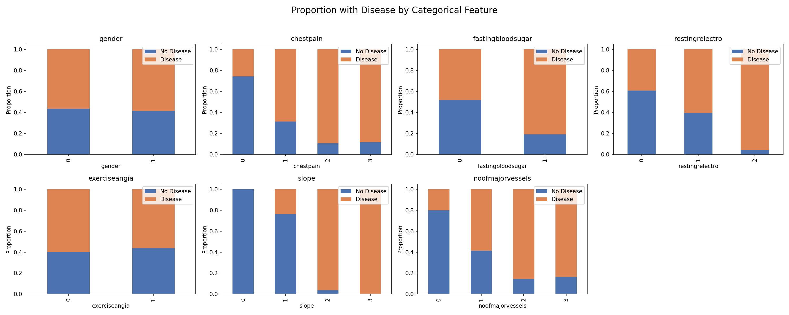
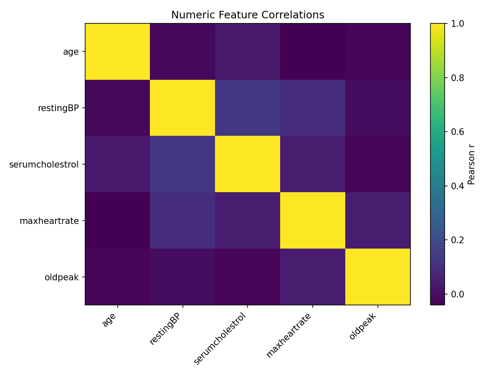
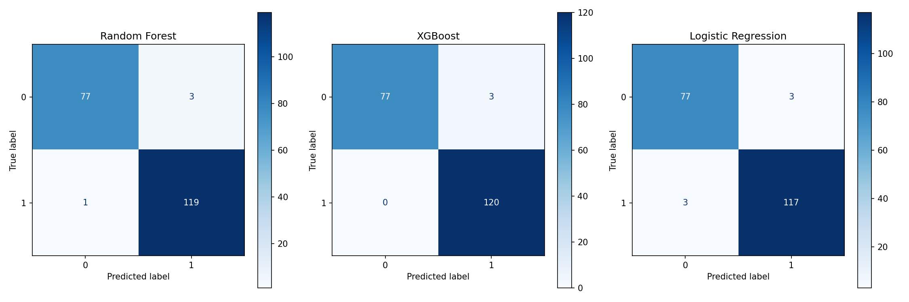
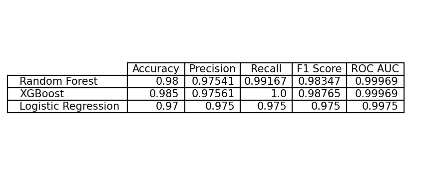

# Heart Disease Risk Predictor

A machine-learning project to predict cardiovascular disease risk from clinical data.

---

## Data

Data was obtained from https://data.mendeley.com/datasets/dzz48mvjht/1

---

## About The Project

This project trains several models (**Random Forest**, **XGBoost**, **Logistic Regression**) on a public cardiovascular dataset to predict disease presence. The workflow includes:

1. **Exploratory Data Analysis** to identify distributions, outliers, and feature correlations.  
2. **Feature engineering & scaling** for numeric and categorical variables.  
3. **Model training & hyperparameter tuning** via randomized search.  
4. **Evaluation** with confusion matrices, accuracy, precision, recall, F1 score, and ROC AUC.  

(<a href="#readme-top">back to top</a>)

---

## Results and Visuals

### Categorical Feature Proportions  
Stacked bar plots showing, for each category level, the proportion of patients with and without heart disease. This highlights which levels (e.g., chest pain type, ST slope) carry the highest risk.  

### Numeric Feature Correlations  
Heatmap of Pearson correlations between numeric features. Low off-diagonal values indicate that each variable contributes largely independent information to the model.  

### Confusion Matrices  
Side-by-side confusion matrices for Random Forest, XGBoost, and Logistic Regression on the test set. The darker diagonal indicates high true-positive and true-negative rates across all three models.  

### Metrics Comparison  
Table of accuracy, precision, recall, F1 score, and ROC AUC for each model, rounded to five decimal places. XGBoost achieves the highest overall AUC and a strong balance of precision and recall.  

(<a href="#readme-top">back to top</a>)

